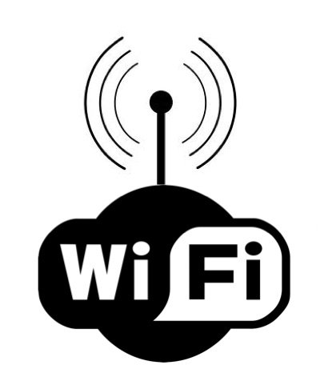

##  SINYAL RF

  Sinyal RF merupakan gelombang elektromagnetik yang digunakan oleh sistem komunikasi untuk mengirim informasi melalui udara dari satu titik ke titik lain. Sinyal RF telah digunakan selama beberapa tahun. Sinyal tersebut memberikan cara untuk mengirimkan musik pada radio FM dan video pada televisi. Pada kenyataannya, sinyal RF juga merupakan sarana umum untuk mengirim data melalui jaringan wireless.

### 

### Sifat-Sifat Sinyal RF

  Sinyal RF merambat di antara antena pemancar pengirim dan penerima. Seperti yang diilustrasikan Gambar 2.7, sinyal yang dipasok pada antena memiliki amplitudo, frekuensi, dan interval. Sifat-sifat tersebut berubah-ubah setiap saat untuk merepresentasikan informasi. Amplitudo mengindikasikan kekuatan sinyal. Ukuran untuk amplitudo biasanya berupa energi yang dianalogikan dengan jumlah usaha yang digunakan seseorang pada waktu mengendarai sepeda untuk mencapai jarak tertentu. Energi, dalam konteks sinyal elektromagnetik, menggambarkan jumlah energi yang diperlukan untuk mendorong sinyal pada jarak tertentu. Saat energi meningkat, jaraknya pun juga bertambah. Gambar 2.7: Amplitudo, Frekuensi, dan Interval merupakan elemen dasar pada sinyal RF, Saat sinyal radio merambat melalui udara, sinyal tersebut kehilangan amplitudo. Jika jarak antara pengirim dan penerima bertambah, amplitudo sinyal menurun secara eksponensial. Pada lingkungan yang terbuka, di mana tidak ada rintangan, sinyal RF mengalamai apa yang disebut para engineer sebagai free-space loss yang merupakan bentuk dari pelemahan. Kondisi tersebut menyebabkan sinyal yang telah dimodulasi melemah secara eksponensial saat sinyal merambat semakin jauh dari antena. Oleh karena itu, sinyal harus memiliki cukup energi untuk mencapai jarak di mana tingkat sinyal bisa diterima sesuai yang dibutuhkan receiver. Kemampuan receiver dalam menerima sinyal tergantung pada kehadiran sinyal-sinyal RF lain yang berada di dekatnya. Frekuensi menyatakan beberapa kali sinyal berulang setiap detiknya. Satuan frekuensi adalah Hertz Hz yang merupakan jumlah siklus yang muncul setiap detik. Sebagai contoh, LAN nirkabel 802.11 beroperasi pada frekuensi 2,4 GHz yang berarti mencakup 2.400.000.000 siklus per detik. Interval berkaitan dengan seberapa jauh suatu sinyal tetap konstan pada titik acuan.

 ### Kelebihan Sinyal RF :

1. Menjangkau jarak yang relatif jauh. Garis pandangnya dapat mencapai 20 mil.
2. Dapat dioperasikan dalam kondisi kabur dan berkabut, kecuali hujan deras yang dapat menyebabkan kinerjanya menjadi lemah.
3. Operasi bebas lisensi (hanya untuk sistem berbasi 802.11)

### Kelemahan Sinyal RF :
1. Dengan jangkauan Mbps, throughput-nya lebih rendah.
2. Sinyal RF mudah terganggu oleh sistem berbasis RF eksternal lain.
3. Perambatan radio melalui sebuah fasilitas lebih rentan.

## INFRARED

  Infrared adalah radiasi elektromagnetik dari panjang gelombang lebih panjang dari cahaya tampak, tetapi lebih pendek dari radiasi gelombang radio. Radiasi inframerah memiliki jangkauan tiga “order” dan memiliki panjang gelombang antara 700 nm dan 1 mm, Inframerah ditemukan secara tidak sengaja oleh Sir William Herschell, astronom kerajaan Inggris ketika ia sedang mengadakan penelitian mencari bahan penyaring optis yang akan digunakan untuk mengurangi kecerahan gambar matahari pada teleskop tata surya.
  

### 

### -Jenis-Jenis Infrared
* Inframerah jarak dekat dengan panjang gelombang 0.75 – 1.5 µm.
* Inframerah jarak menengah dengan panjang gelombang 1.50 – 10 µm.
* Inframerah jarak jauh dengan panjang gelombang 10 – 100 µm. Sinar infrared ada pada cahaya api,cahaya matahari, radiator kendaraan atau pantulan jalan aspal yang terpapar panas.

### -Kelebihan Infrared
* Pengiriman data dengan infra merah dapat dilakukan kapan saja, karena pengiriman dengan inframerah tidak membutuhkan sinyal.
* Pengiriman data dengan infra merah dapat dikatakan mudah karena termasuk alat yang sederhana.
* Pengiriman data dari ponsel tidak memakan biaya (gratis).

### -Kekurangan Infrared
* Pada pengiriman data dengan inframerah, kedua lubang inframerah harus berhadapan satu sama lain. Hal ini agak menyulitkan kita dalam mentransfer data karena caranya yang merepotkan.
* Infrared sangat berbahaya bagi mata, sehingga jangan sekalipun sorotan inframerah mengenai mata
* Pengiriman data dengan inframerah dapat dikatakan lebih lambat dibandingkan dengan rekannya bluetooth.

## BLUETOOTH

  Bluetooth adalah suatu peralatan media komunikasi yang dapat digunakan untuk menghubungkan sebuah perangkat komunikasi dengan perangkat komunikasi lainnya, bluetooth umumnya digunakan di handphone, komputer atau pc, tablet, dan lain-lain. Fungsi bluetooth yaitu untuk mempermudah berbagi atau sharing file, audio, menggantikan penggunaan kabel dan lain-lain. Saat ini sudah banyak sekali perangkat yang menggunakan bluetooth.
  
  
 
 
 ### Prinsip Kerja Bluetooth
 
  Bluetooth sebenarnya muncul ditujukan guna mengatasi sejumlah kendala komunikasi data antar peranti elektronik yang lebih dahulu hadir, Bluetooth bekerja memakai frekuensi radio. Beda dengan inframerah yang mendasarkan diri pada gelombang cahaya. Jaringan Bluetooth bekerja pada frekuensi 2.402 Giga Hertz hingga dengan 2.480 Giga Hertz. Dibangkitkan dengan daya listrik kecil sehingga memberi batas daya jangkaunya melulu sampai 10 meter.
Penetapan frekuensi ini sudah distandardisasi secara internasional untuk perlengkapan elektronik yang digunakan untuk kepentingan industri, ilmiah, dan medis. Kecepatan transfer data Bluetooth rilis 1.0 ialah 1 mega bit per detik (Mbps), sementara versi 2.0 dapat menangani pertukaran data sampai 3 Mbps.

### Kelebihan Dan Kekurangan Bluetooth

#### - Kelebihan:
* Bisa menembus rintangan, misalnya seperti dinding, kotak, dan sebagainya. Walaupun jarak transmisinya hanya 10 M.
* Tidak memerlukan media kabel ataupun kawat.
* Dapat mensingkronisasi data dari Handphone ke Komputer atau laptop.
* Dapat dipakai sebagai perantara modem.
* Praktis dan tidk ribet dalam penggunaanya.

#### - Kekurangan:
* Memakai frekuensi yang sama dengan gelombang WiFi.
* Kalau terlalu banyak koneksi bluetooth didalam satu ruangan, akan sulit untuk menemukan penerima yang dituju.
* Sering beredar virus-virus yang disebarkan melalui bluetooth, khususnya dari handphone.
* Cukup banyak mekanisme keamanan yang harus diperhatikan untuk mencegah kegagalan pengiriman data atau penerimaan data maupun informasi.
* Kecepatan dalam transfer data tidak tetap, tergantung dari perangkat yang dipakai untuk mengirim dan yang menerima data maupun informasi.

## WIFI

  Wi-Fi adalah sebuah teknologi yang memanfaatkan peralatan elektronik untuk bertukar data secara nirkabel (menggunakan gelombang radio) melalui sebuah jaringan komputer, termasuk koneksi Internet berkecepatan tinggi, WiFi juga merupakan Jaringan Area Lokal atau LAN (Local Area Network) yang tidak memerlukan kabel dengan koneksi kecepatan yang tinggi. Wi-Fi sering disebut juga dengan WLAN atau Wireless Local Area Network, Sinyal Radio adalah kunci yang memungkinan komunikasi dalam jaringan WiFi. Teknologi WiFi ini menggunakan dua frekuensi gelombang radio dalam mengirimkan dan menerima sinyal Radio. Kedua Frekuensi gelombang radio tersebut adalah Frekuensi 2,4GHz dan 5GHz.
Contoh alat yang dapat memakai Wi-Fi (seperti komputer, laptop, smartphone, dan tablet) dapat terhubung dengan sumber jaringan seperti internet melalui sebuah titik akses jaringan nirkabel. Titik akses (hotspot) seperti itu mempunyai jangkauan sekitar 20 meter (65 kaki) di dalam ruangan dan lebih luas lagi di luar ruangan.

#### Standar Jaringan WiFi 802.11
Seiring dengan perkembangan teknologi WIFI, saat ini terdapat beberapa standar jaringan WiFi yang umum digunakan. Berikut ini adalah beberapa Standarisasi WiFi 802.11 yang umum digunakan.

1. Standarisasi 802.11a
Standarisasi 802.11a dapat mentransmisikan sinyal pada frekuensi 5GHz dengan kecepatan koneksi hingga 54 Mbps (Megabit data per detik). 802.11a ini menggunakan Orthogonal Frequency-Division Multiplexing (OFDM) yaitu teknik pengkodean yang lebih efisien yang membagi sinyal radio menjadi beberapa sub-sinyal sebelum mencapai penerima sehingga dapat mengurangi gangguna atau interference dalam koneksi.

2. Standarisasi 802.11b
802.11b adalah standard WiFi yang koneksinya paling lambat dengan harga yang paling murah. Standarisasi 802.11b pernah menjadi sangat popular karena harganya yang murah, tetapi sekarang menjadi kurang umum karena standarisasi WiFi dengan koneksi yang lebih cepat menjadi semakin murah. 802.11b yang mentransmisikan sinyal dalam pita frekuensi 2,4 GHz spektrum radio ini dapat menangani kecepatan hingga 11 Mbps (megabit data per detik) dan menggunakan modulasi Kode Kunci Pelengkap atau Complementary Code Keying (CCK) untuk meningkatkan kecepatannya.

3. Standarisasi 802.11g
802.11g menggunakan pita frekuensi 2,4 GHz Spektrum Radio seperti pada standarisasi 802.11b, tetapi kecepatan 802.11g jauh lebih cepat dibandingkan dengan standarisasi 802.11b.  Standarisasi WiFi 802.11g dapat menangani kecepatan koneksi hingga 54 megabit data per detik. Standarisasi WiFi ini dapat lebih cepat karena menggunakan pengkodean OFDM yang sama dengan 802.11a.

4. Standarisasi 802.11n
Standarisasi WiFi 802.11n adalah standar yang paling umum digunakan saat ini dan kompatibel dengan standarisasi lainnya seperti standarisasi 802.11a, b dan g. Standarisasi WiFi 802.11n ini memiliki peningkatan kecepatan dan jangkauan yang signifikan daripada pendahulunya. Standarisasi 802.11n dilaporkan dapat mencapai kecepatan setinggi 600 megabit per detik. Standarisasi 802.11n ini dapat mentransmisikan hingga empat aliran jalur data (4 spatial streams), tetapi sebagian besar router WiFi hanya memungkinkan untuk mentransmisikan dua atau tiga aliran jalur saja. WiFi 802.11n menggunakan pita frekuensi 2,4GHz dan 5GHz.

5. Standarisasi 802.11ac
Standarisasi 802.11ac adalah standar terbaru yang diperkenalkan pada awal 2013. Standarisasi Ini belum diadopsi secara luas dan masih dalam bentuk draft di Institute of Electrical and Electronics Engineers (IEEE), tetapi perangkat yang mendukungnya sudah ada yang tersedia di pasaran. Standarisasi WiFi 802.11ac ini kompatibel dengan 802.11n. Dengan kata lain, WiFi 802.11ac ini juga kompatibel dengan standarisasi WiFi lainnya juga. Standarisasi WiFi 802.11ac menggunakan pita frekuensi 5 GHz dengan kecepatan hingga 1,3 Gigabit per detik pada satu aliran jalur, namun pada kenyataannya mungkin lebih rendah. Seperti 802.11n, Standarisasi ini memungkinkan transmisi pada beberapa aliran spasial hingga delapan aliran jalur.

#### Kelebihan Wifi
Home » Kekurangan » Kelebihan » Wi-Fi » Kelebihan dan Kekurangan Wi-Fi
BY SALMAN FAUZAN KEKURANGAN KELEBIHAN WI-FI
Kelebihan dan Kekurangan Wi-Fi
Sebelum kita membahas Kelebihan dan Kekurangan Wi-Fi, alangkah baiknya kita harus mengenal apa itu pengertian Wi-Fi. Wi-Fi adalah sebuah teknologi yang mempunyai kegunaan atau manfaat untuk bertukar data secara nirkabel (menggunakan gelombang radio) oleh karena itu dengan mempergunakan teknologi nirkabel Wi-Fi dapat mentransfer data lebih cepat dan aman. Berikut di bawah ini saya akan jelaskan beberapa Kelebihan dan Kekurangan Wi-Fi :

#### -Kelebihan :
* Produk Wi-Fi tersedia secara luas di pasaran.
* Network ini di design untuk punya symetric up and down speed.
* Wi-Fi merupakan pilihan jaringan yang sangat ekonomis karena harga paket ship Wi-Fi yang terus menurun.
* Tersebar Luas di lebih dari 250.000 tempat umum, jutaan rumah, perusahaan dan universitas di seluruh dunia.
* Memungkinkan LAN untuk digunakan tanpa kabel, biasanya mengurangi biaya penyebaran jaringan dan ekspansi. Ruang di mana kabel tidak dapat dijalankan, seperti area outdoor dan bangunan bersejarah, dapat menggunakan LAN Wireless.
* Wi-Fi dikembangkan tanpa kabel dan menggunakan gelombang radio dengan frekuensi 2,4 GHz. Selain itu Wi-Fi dapat mengirim dan menerima kapasitas sampai 54Mbps.
* Wi-Fi menggunakan jalur akses jaringan / hot spot, dapat berkomunikasi ke semua komputer dan laptop.Wireless klien: PCMACIA / PC Card, Gateway, server, modem, router dan proxy.
* Wi-Fi adalah perangkat standar global. 
* Tidak seperti operator selular, klien Wi-Fi yang sama bekerja di berbagai negara di seluruh dunia.

#### -Kekurangan :
* Wi-Fi menggunakan spektrum 2.4GHz tanpa izin, dimana yang sering bertabrakan dengan perangkat lain seperti Bluetooth, oven microwave, telepon tanpa kabel, atau perangkat pengirim video, banyak lainnya. Hal ini dapat menyebabkan penurunan kinerja.
* Adanya kelemahan yang terletak pada konfigurasi dan jenis enkripsi. Kelemahan tersbut diakibatkan karena terlalu mudahnya membangun sebuah jaringan wireless.
* Jalur akses gratis dapat digunakan oleh orang tak dikenal dan berbahaya untuk melakukan serangan yang akan sangat sulit untuk melacak di luar jalur akses pemilik.
* Penyaluran Gelombang dan keterbatasan operasional yang tidak konsisten di seluruh dunia.
* Wired Equivalent Privacy (WEP) yang menjadi standart keamanan wireless sebelumnya dapat dengan mudah dipecahkan dengan berbagai tools yang tersedia gratis di internet.
* Intervensi pada jalur akses tertutup atau dienkripsi dengan jalur akses terbuka yang lainnya pada saluran yang sama atau dekat dapat mencegah akses ke jalur akses yang terbuka oleh orang lain di daerah tersebut. Ini menimbulkan masalah tinggi di daerah kepadatan tinggi seperti blok apartemen besar di mana banyak penduduk beroperasi poin akses Wi-Fi.
* Jalur akses dapat digunakan untuk mencuri informasi pribadi dan rahasia ditransmisikan dari konsumen Wi-Fi.
* Jaringan Wi-Fi memiliki rentang yang terbatas. Sebuah router Wi-Fi rumah mungkin memiliki kisaran 45m (150ft) indoor dan 90 juta (300ft) di luar rumah.
* Konsumsi Power yang cukup tinggi jika dibandingkan dengan beberapa standar lainnya, membuat masa pakai baterai berkurang dan panas.
